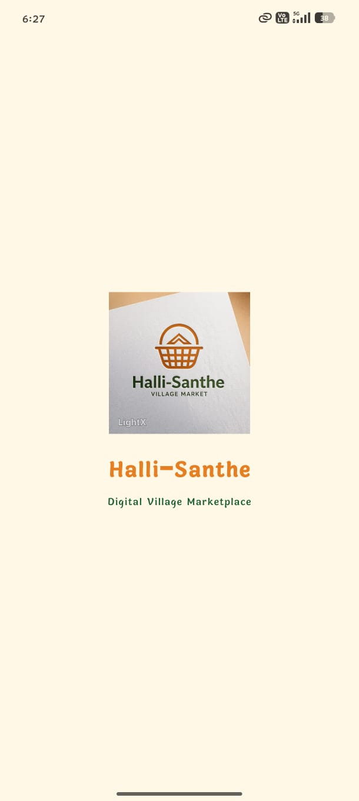
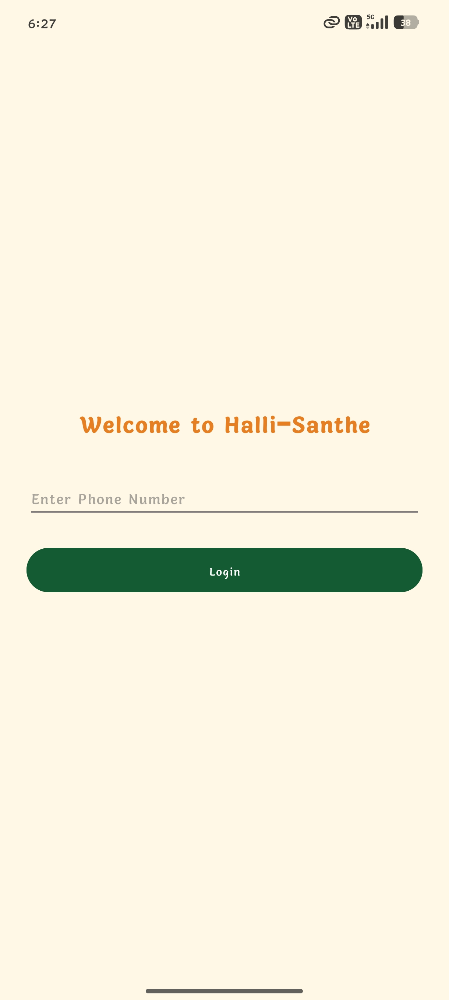
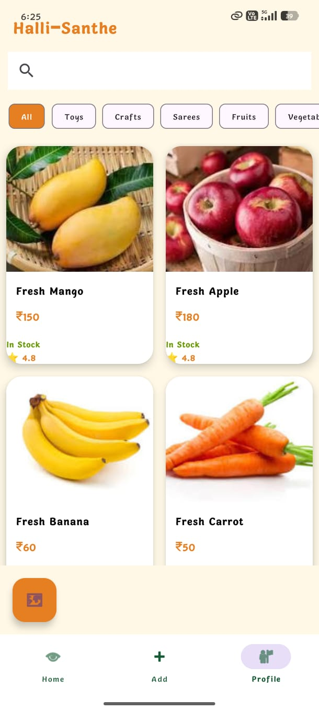
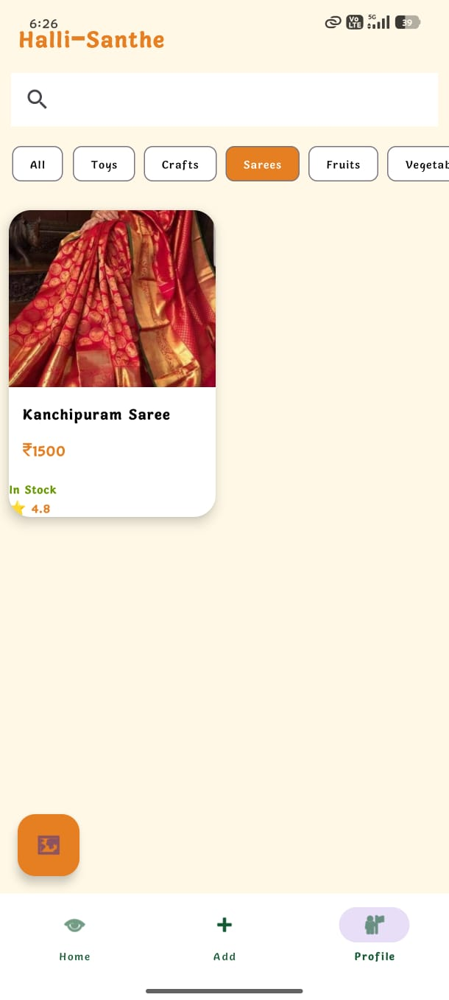
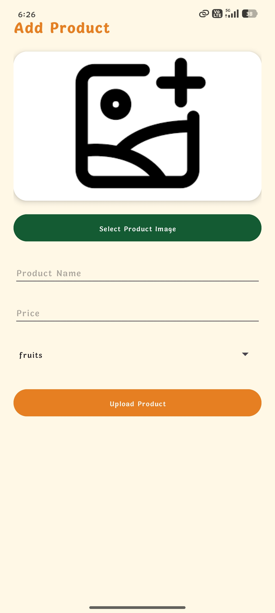
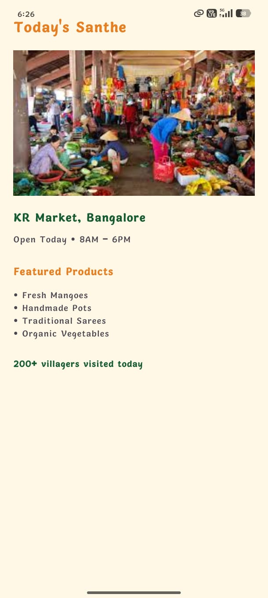
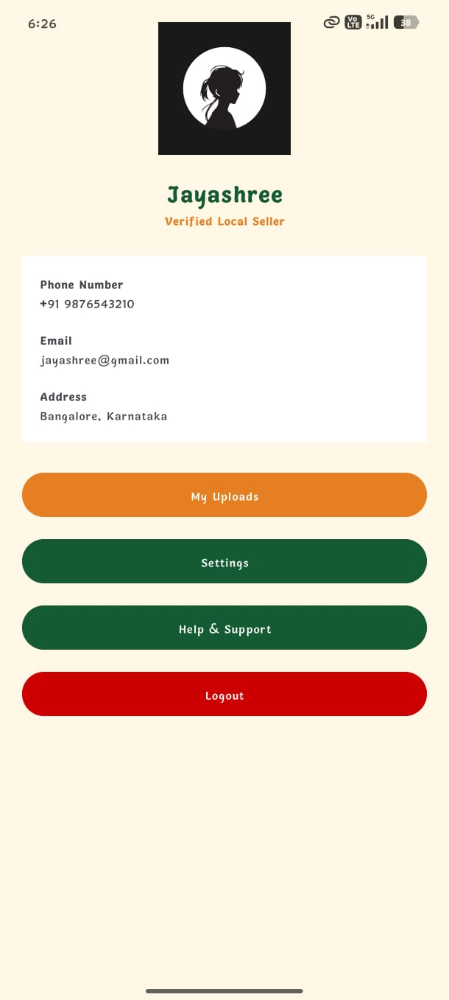
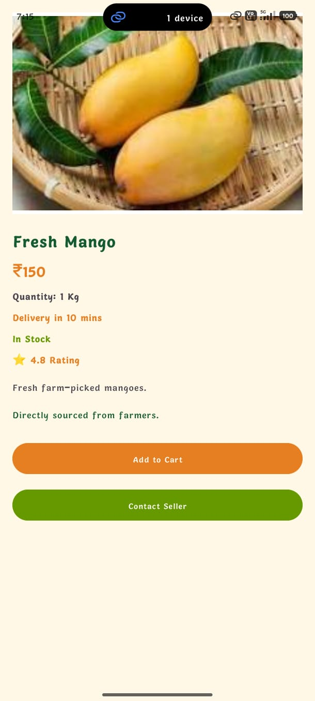
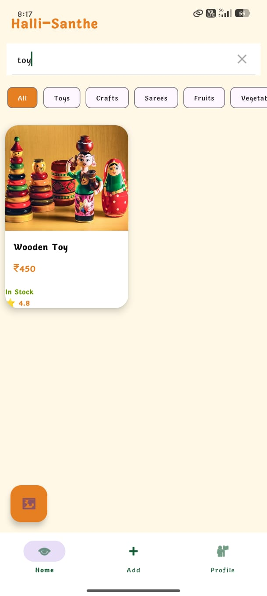

# Halli-Santhe

## Android-Based Digital Village Marketplace

Halli-Santhe is a modern Android ecommerce application developed to digitally connect local farmers, artisans, and rural sellers with customers through a village marketplace platform.

The application provides product browsing, category filtering, search functionality, seller profiles, marketplace information, and product upload features using a clean ecommerce-inspired user interface.

The project is developed using Kotlin, XML, Android Studio, RecyclerView, Firebase Firestore, and Material Design Components.

## Application Screenshots

### Splash Screen

### Login Screen

### Home Screen

### Fruits Filter

### Sarees Filter

### Add Product Screen

### Marketplace Screen

### Profile Screen

### Product Information Screen

### Search Screen

## Key Features

- Product Listing with Images
- Category-Based Product Filters
- Search Functionality
- Add Product Screen
- Seller Profile Screen
- Marketplace Information Screen
- RecyclerView Product Cards
- Bottom Navigation Bar
- AI-Inspired Product Descriptions
- Modern Ecommerce UI

## Technologies Used

- Kotlin
- XML
- Android Studio
- Firebase Firestore
- RecyclerView
- CardView
- Material Design Components
- Android Intents

## Project Objectives

- Support local farmers and artisans
- Create a digital village marketplace
- Improve local business visibility
- Provide modern ecommerce experience
- Enable easy product browsing and searching
- Promote rural digital transformation
